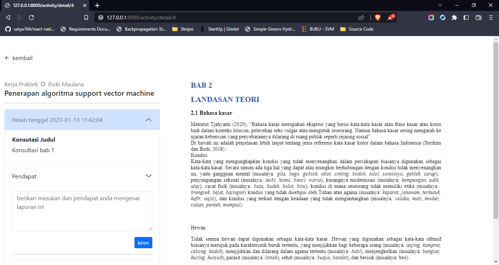

# Sistem Konsultasi Online


## Latar Belakang ( Masalah )
`SKO` atau ( sistem konsultasi online ) merupakan sebuah sistem yang bertujuan untuk mengatasi permasalahan dalam konsulasi `kerja praktek, kkn hingga skripsi` permasalahan yang diselesaikan meliputi :

| Masalah | Deskripsi |
|-|-|
| Pemborosan kertas dan biaya | Pada saat mengerjakan skripsi atau kerja praktek maka untuk konsultasi kita diharuskan untuk print semua laporannya dan itu pun belum tentu benar |
| Pemborosan waktu | Pada saat melakukan konsultasi dan bertemu dosen sering kali dosen tersebut tidak ada ditempat atau terlambat datang dan hal ini menyebabkan pemborosan waktu karena mahasiswa/i harus datang ke kampus jauh jauh dari rumah namun dosen yang bersangkutan tidak ada |
| Tidak fleksibel | Waktu konsultasi tidak ada jadwal pasti sehingga terkadang saat kita pergi ke kampus pada suatu hari X dosennya tidak ada karena tidak ada jadwal konsultasi yang pasti |
| Proses memakan waktu | Pada saat memeriksa dokumen karena harus di print maka mau tidak mau dosen memeriksanya harus dikampus atau dibawa pulang sedangkan membawa dokumen tidaklah mudah |

## Pembahasan ( Fitur dan Solusi )
Dari permasalahan diatas maka dapat dirumuskan dan dihasilkan fitur sebagai berikut :

| No | Nama Fitur | Deskripsi | Role |
|-|-|-|-|
|1| Request bimbingan kerja praktek atau skripsi | mahasiswa/i dapat melakukan permintaan bimbingan konsultasi kp atau skripsi dengan cara menginputkan informasi tentang judul, objek penelitian dan lain sebagainya | `mahasiswa/i` |
|2| Request koreksi laporan | Dalam mengerjakan laporan kp ataupun skripsi kita biasanya memulai dari BAB 1 dan untuk melanjutkan ke bab berikutnya harus konsultasi menyerahkan BAB 1 tersebut, oleh karena itu pada fitur ini mahasiswa/i dapat mengirimkan laporan yang telah selesai dalam bentuk dokumen| `mahasiswa/i`|
|3| Pembaca Dokumen word (`.docs, docx`) | Mahasiswa/i tidak perlu lagi melakukan print dokumen pada saat konsultasi karena bisa tinggal diupload dan dibuka secara online. begitupun bagi dosen tidak perlu mendownloadnya hanya tinggal membuka nya secara online sudah disediakan | `dosen` dan `mahasiswa/i` |
|4| Pemberian Saran, Masukan atau Kritik | Jika mahasiswa konsultasi maka dosen akan memberikan masukan terhadap laporannya. difitur ini dosen bisa dengan mudah memberikan masukan terhadap laporan mahasiswa/i. dan bagi `mahasiswa` mereka bisa dengan mudah melihat masukan dari dosen nya tanpa harus pergi ke kampus | `dosen` dan `mahasiswa/i` |


# Cara Menginstall

Jika anda adalah seorang developer atau mahasiswa informatika dan sejenisnya bila anda ingin mengembangkan aplikasi ini maka tahapnya adalah sebagai berikut

#### 1. Pindahkan source code ke perangkat anda

```bash
git clone https://github.com/rizki4106/Sistem-konsultasi-online.git
```

```bash
cd Sistem-konsultasi-online composer install && npm install && php artisan generate:key
```

#### 2. Buat file .env
Buatlah file .env pada root project dan isi dengan data sebagai berikut

```.env
DB_CONNECTION=mysql
DB_HOST=127.0.0.1
DB_PORT=3306
DB_DATABASE=NAMA DATABASE
DB_USERNAME=USERNAME DATABASE
DB_PASSWORD=PASSWORD DATABASE
```

sesuaikan pengaturan file `.env` diatas sesuai dengan pengaturan anda

#### 3. Migrasi
Lakukan migrasi dengan tujuan untuk membuat tabel yang diperlukan

```bash
php artisan migrate
```

#### 4. Menjalankan Aplikasi
Berikut ini adalah cara menjalankan aplikasi dalam mode development

```bash
php artisan serve
```

karena project ini memerlukan hot reload pada saat anda mengedit tampilan makan anda perlu menjalankan perintah sebagai berikut

```bash
npm run dev
```

aplikasi akan berjalan pada url `http://127.0.0.1:8000`

## Selanjutnya

Akan ada tahap selanjutnya jika `mvp` ini bermanfaat dan dapat diterpkan oleh unversitas atau sekolah tinggi dan tentunya dengan mempertimbangkan masukan serta saran dari berbagai pihak

#### Tech Stack
`laravel 9` `bootstrap 5.3`